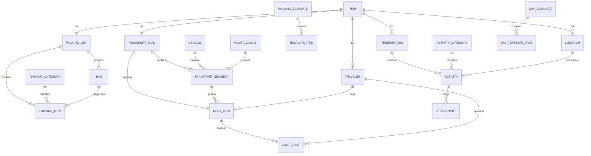
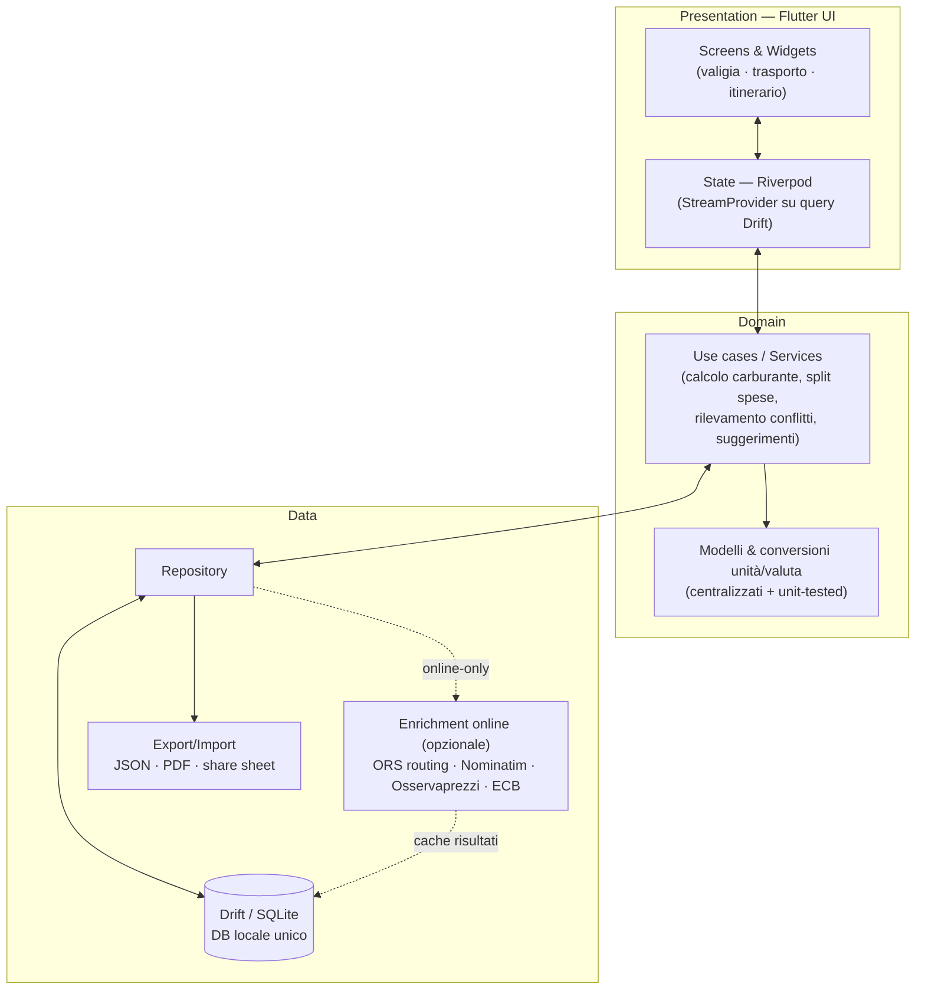
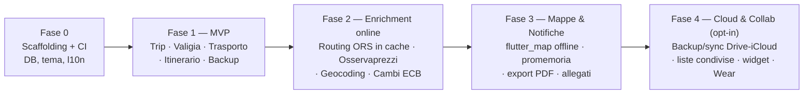

# Organizzatore Viaggi — Documento di Analisi e Requisiti

> **Documento**: Analisi & Requisiti (v1.0)
> **Nome in codice del prodotto**: *Itinera* (working title — sostituibile)
> **Data**: 2026-08-10
> **Ruolo estensore**: PM / Analista tecnico
> **Stato**: 🟡 Bozza in attesa di approvazione — *alla tua conferma si passa a scaffolding e implementazione*
> **Piattaforme target**: Android + iOS (una sola codebase)

---

## 0. Come leggere questo documento

Questo è il documento fondativo su cui si baserà l'implementazione. È organizzato in modo che ogni scelta sia **motivata**: prima *cosa* deve fare l'app (analisi e requisiti), poi *come* e *con cosa* la costruiamo (architettura e tecnologie), infine *in che ordine* (MVP e roadmap).

Le decisioni tecnologiche più importanti sono raccolte anche in forma sintetica nel **§9 Decision Log (ADR)** per riferimento rapido.

---

## 1. Sintesi esecutiva

**Itinera** è un'app mobile (Android + iOS) che aiuta una persona a **organizzare una vacanza dall'inizio alla fine**, coprendo i tre momenti che oggi si gestiscono a mano su fogli, note e chat sparse:

1. **La valigia** — cosa mettere in valigia, diviso per categorie, con spunta di ciò che è pronto, liste riutilizzabili e controllo peso bagagli.
2. **Il viaggio (trasporto)** — con quale mezzo, che percorso, quanta benzina, quanto costa; stima e consuntivo delle spese.
3. **L'itinerario (tabella di marcia)** — cosa si fa giorno per giorno, con orari, luoghi e attività.

**Principio guida: offline-first.** L'app deve funzionare **al 100% senza connessione**, perché la si usa proprio in viaggio, spesso all'estero, dove i dati mobili sono assenti o costosi. Ogni funzione online (es. calcolo automatico delle distanze) è un *di più* opzionale costruito sopra un'alternativa manuale che funziona sempre.

**Stack scelto: Flutter + Dart, con database locale Drift/SQLite.** La motivazione dettagliata è nel §8; in una riga: è lo stack che massimizza la velocità di sviluppo per uno sviluppatore solo che **già conosce Flutter**, ha il miglior ecosistema per mappe/notifiche/export offline, e non ha costi di backend in v1.

**Vincolo pratico gestito by-design:** lo sviluppo avviene su **Windows** (nessun Mac), quindi la build iOS passa da **CI cloud con Mac** (Codemagic) — nessuna riga di codice iOS viene compilata localmente.

---

## 2. Visione, obiettivi e non-obiettivi

### 2.1 Visione
Un unico posto, che sta in tasca e funziona ovunque, per **pianificare** una vacanza prima di partire e **consultarla/aggiornarla** durante, senza dipendere dalla rete.

### 2.2 Obiettivi di prodotto (cosa vogliamo ottenere)
- **O1** — Ridurre l'ansia da "ho dimenticato qualcosa": checklist valigia per categorie con essenziali evidenziati e controllo peso.
- **O2** — Dare **visibilità sui costi del viaggio** prima di partire (stima carburante/biglietti) e tenerne traccia durante.
- **O3** — Trasformare un elenco confuso di "cose da vedere" in una **tabella di marcia giorno-per-giorno** ordinata e senza sovrapposizioni.
- **O4** — Essere **affidabile offline**: nessuna schermata che si blocca in attesa della rete.
- **O5** — Non perdere mai i dati del viaggio (backup/export a portata di un tap).

### 2.3 Obiettivi tecnici
- Una sola codebase per Android e iOS.
- Costo di esercizio ~0 € in v1 (nessun backend, nessuna API a pagamento sul percorso critico).
- Manutenibilità a lungo termine da parte di **una sola persona**.

### 2.4 Non-obiettivi (fuori scope, almeno per la v1)
- ❌ Prenotazioni/booking reali (voli, hotel) o integrazione con OTA.
- ❌ Backend proprietario, account utente, login social.
- ❌ Navigazione turn-by-turn / routing stradale offline on-device.
- ❌ Collaborazione multi-utente in tempo reale (sync condiviso).
- ❌ Social feed, gamification, AI planner.

> Molti di questi diventano **candidati per le fasi future** (§11), ma tenerli fuori dalla v1 è una scelta deliberata per proteggere tempi e manutenibilità.

---

## 3. Utente e scenari d'uso

### 3.1 Persona primaria
**"Il viaggiatore organizzatore"** — pianifica da sé le vacanze (proprie, in coppia o per un gruppo di amici/famiglia), tiene d'occhio il budget, e spesso guida o combina più mezzi. Usa lo smartphone come strumento principale. Vuole preparare tutto con calma da casa (con Wi-Fi) e poi avere tutto disponibile **offline** in viaggio.

### 3.2 Scenari (user journey)
- **S1 — Preparazione da casa (online):** crea il viaggio, sceglie il tipo (mare/montagna/città/…), applica una lista valigia suggerita, definisce le tratte del viaggio e lascia che l'app calcoli distanze e carburante, abbozza l'itinerario dei giorni. Fa un **backup** prima di partire.
- **S2 — In viaggio (offline):** spunta gli oggetti mentre riempie la valigia; controlla il peso del bagaglio a mano in aeroporto; consulta la giornata; sposta un'attività saltata; registra una spesa reale (pedaggio, cena).
- **S3 — Road trip in auto:** inserisce le tappe, l'app somma i km e stima litri e costo carburante col consumo della *sua* auto; a fine viaggio confronta stima vs speso reale.
- **S4 — Viaggio di gruppo:** aggiunge i compagni, divide le spese (equa/pesata/personalizzata) e ottiene il **riepilogo "chi deve quanto a chi"**.

---

## 4. Requisiti funzionali

Convenzione ID: `TRIP-xx` (nucleo comune), `VAL-xx` (valigia), `TRA-xx` (trasporto), `ITI-xx` (itinerario). Priorità: **[M]** = MVP v1, **[F]** = fase futura.

### 4.0 Nucleo comune — Viaggio (Trip)
| ID | Requisito | Prio |
|----|-----------|------|
| TRIP-01 | Creare/modificare/eliminare/**duplicare** un viaggio con nome, destinazione, Paese, data inizio/fine (opzionali per bozza), tipo viaggio, clima, n° viaggiatori, valuta di casa. | M |
| TRIP-02 | Home con elenco viaggi raggruppati in *In arrivo* / *Passati*, con immagine di copertina opzionale. | M |
| TRIP-03 | Gestire i **viaggiatori** del viaggio (nome, colore, "sono io", peso-quota per lo split spese). | M |
| TRIP-04 | Ogni viaggio aggrega i tre moduli (valigia, trasporto, itinerario) e un **costo totale stimato** di viaggio. | M |
| TRIP-05 | Impostazioni globali: lingua (IT, predisposto EN), valuta, unità (metrico/imperiale), consumo e prezzo carburante di default. | M |

### 4.1 Modulo VALIGIA (organizzazione bagagli)
| ID | Requisito | Prio |
|----|-----------|------|
| VAL-01 | Aggiungere oggetti con nome, quantità (default 1), categoria, borsa (opz.), peso unitario (opz.), flag **essenziale**. | M |
| VAL-02 | Oggetti **raggruppati per categoria**; categorie di sistema predefinite in italiano (Documenti, Abbigliamento, Igiene, Scarpe, Elettronica, Farmaci, Accessori, Varie) con icona e colore; categoria di default "Varie". | M |
| VAL-03 | **Spuntare** gli oggetti come preparati; supporto spunta parziale (`packedCount` da 0 a quantità). | M |
| VAL-04 | Avanzamento in tempo reale: preparati/totali e percentuale, per l'intera lista **e per singola borsa**. | M |
| VAL-05 | **Più borse** per lista (bagaglio a mano/stiva/personale/zaino), con tara e limite peso opzionale del vettore. | M |
| VAL-06 | Calcolo peso borsa = tara + Σ(peso unitario × quantità); **avviso** se supera il limite. Se mancano pesi, il totale è marcato "parziale/stima" e l'avviso è sospeso. | M |
| VAL-07 | **Liste suggerite** (template built-in) per tipo viaggio + durata; applicazione con un tap. | M |
| VAL-08 | Salvare una lista (o un sottoinsieme) come **template riutilizzabile** personale. | M |
| VAL-09 | **Suggerimento quantità** in base a durata (giorni/notti), clima e n° viaggiatori (regole deterministiche); accettabili singolarmente o in blocco; distinzione oggetti condivisi vs per-persona. | F |
| VAL-10 | Riordino oggetti/categorie (drag & drop) persistente; ricerca e filtro per testo/stato/borsa. | M |
| VAL-11 | Duplicare una lista (struttura + oggetti) con spunte azzerate; eliminare oggetto/borsa/lista con conferma (eliminando una borsa gli oggetti restano, diventano "non assegnati"). | M |
| VAL-12 | Evidenziare gli **essenziali** non ancora preparati in un "controllo finale" pre-partenza. | M |
| VAL-13 | Condividere/esportare la lista via *share sheet* del sistema come testo leggibile **e** come JSON re-importabile. | M |
| VAL-14 | Stato "da comprare" con sotto-lista shopping distinta dall'avanzamento valigia. | F |
| VAL-15 | Allegato foto per oggetto/borsa; suggerimenti meteo-informati (Open-Meteo, cache offline). | F |

### 4.2 Modulo TRASPORTO (viaggio: mezzo, percorso, benzina, costi)
| ID | Requisito | Prio |
|----|-----------|------|
| TRA-01 | Un **piano di trasporto** per viaggio con una o più **tratte ordinate**; ogni tratta ha un mezzo tra {auto, moto, camper, aereo, treno, traghetto, bus, taxi, bici, a piedi, altro}. | M |
| TRA-02 | Ogni tratta: origine/destinazione (testo + coordinate opz.), ordine (riordinabile come timeline), andata/ritorno. | M |
| TRA-03 | **Distanza** risolta con priorità: (a) manuale, (b) routing online (se connesso), (c) cache di una tratta identica già cercata, (d) linea d'aria (haversine × fattore percorso, default 1.3, editabile). La fonte usata è salvata e mostrata. | M (a,d) / F (b,c) |
| TRA-04 | Per tratte auto/moto/camper: **litri = (km/100) × consumo**, **costo = litri × prezzo €/L** (elettrico: kWh/100km). Risultato a 2 decimali, per singola tratta e totale. | M |
| TRA-05 | **Veicoli** salvabili (tipo carburante, consumo + unità, targa, default): selezionandone uno la tratta eredita consumo e prezzo, salvati come *snapshot* sulla tratta (modifica/archiviazione veicolo non altera i costi storici). | M |
| TRA-06 | Ogni tratta ha **costo stimato** (auto = carburante [+ pedaggi/parcheggi]; mezzi con biglietto = manuale) e **costo reale** aggregato dalle voci di spesa. | M |
| TRA-07 | **Voci di spesa** in categorie {carburante, biglietto, pedaggio, parcheggio, noleggio, bagaglio, assicurazione, taxi, altro} con importo, valuta, data, pagante, stato (stima/reale), foto ricevuta (locale). | M |
| TRA-08 | Totali di piano **stima** e **reale**, convertiti in valuta base; conversione con tasso manuale o ultimo tasso ECB in cache (offline sempre possibile). | M (conv. manuale) |
| TRA-09 | **Divisione spese** tra viaggiatori: equa / pesata / personalizzata; le quote riconciliano l'importo entro 0,01. | M |
| TRA-10 | **Riepilogo settle-up**: saldo netto per viaggiatore e set minimo di rimborsi suggeriti. | M |
| TRA-11 | Import prezzi carburante da **Osservaprezzi Carburanti (MIMIT)** open data quando online, in cache per uso offline; fuori Italia → prezzo manuale/media nazionale. | F |
| TRA-12 | Invertire l'intero percorso in un tap per costruire il ritorno; duplicare una tratta. | M |
| TRA-13 | Per aereo/treno/traghetto/bus: campi operatore, codice prenotazione, posto/cabina; escluse dal calcolo carburante. | M |
| TRA-14 | Validazione numerica (distanza/consumo/prezzo/tasso finiti e > 0); tratte incomplete escluse dai totali e segnalate, mai conteggiate a zero silenziosamente. | M |
| TRA-15 | Orari partenza/arrivo con fuso; durata calcolata; avviso su arrivo-prima-di-partenza e sovrapposizioni. | F |
| TRA-16 | Stima emissioni CO₂ per tratta; toll estimation autostrade; anteprima mappa del percorso (polyline in cache). | F |

### 4.3 Modulo ITINERARIO (tabella di marcia)
| ID | Requisito | Prio |
|----|-----------|------|
| ITI-01 | Generare una **timeline giorno-per-giorno** per ogni data tra inizio e fine viaggio (estremi inclusi). | M |
| ITI-02 | Aggiungere **attività** a un giorno con titolo (obbligatorio), orario inizio/fine (opzionali), luogo, categoria, costo, note. | M |
| ITI-03 | Ordinamento del giorno per orario crescente (le attività senza orario dopo, per `sortIndex` manuale); **riordino drag & drop** persistente. | M |
| ITI-04 | Rilevare e **segnalare sovrapposizioni** di orario nello stesso giorno; flag "ignora conflitto" per sovrapposizioni volute. | M |
| ITI-05 | **Spostare** un'attività da un giorno all'altro; **bucket "Non programmato"** per attività non ancora assegnate o rimaste fuori intervallo (nessuna perdita dati). | M |
| ITI-06 | Categorie attività predefinite (Cibo, Visita, Trasporto, Alloggio, Relax, Shopping, Altro) con icona/colore; default "Altro". | M |
| ITI-07 | Associare un **luogo** (etichetta + coordinate o indirizzo) e **aprirlo nell'app mappe** di sistema via URI `geo:` (nessuna rete propria). | M |
| ITI-08 | Costo per attività con valuta → totali per-giorno e per-viaggio. | M |
| ITI-09 | Stato attività: pianificata / fatta / saltata / annullata. | M |
| ITI-10 | Validazione: fine ≥ inizio; supporto attività a cavallo della mezzanotte (giorno proprietario = quello di inizio, badge overflow sul giorno dopo). | M |
| ITI-11 | Salvare una giornata come **Modello di giornata** (orari relativi) e applicarla a un altro giorno (con scelta merge/replace se il giorno è pieno). | F |
| ITI-12 | Riepilogo per-giorno (n° attività, durata pianificata, costo, n° conflitti); ricerca/filtro su tutto il viaggio per titolo/categoria/stato. | M |
| ITI-13 | Allegati di prenotazione (PDF/immagini/biglietti) per attività, salvati in locale per fruizione offline. | F |
| ITI-14 | Orari memorizzati nel **fuso del viaggio/tratta** (non del dispositivo), stabili attraversando confini orari; export giornata/itinerario in PDF/testo. | F |

---

## 5. Requisiti non funzionali (NFR)

| # | Categoria | Requisito |
|---|-----------|-----------|
| NFR-1 | **Offline-first** | Il 100% dei flussi core funziona in modalità aereo. Nessuna schermata si blocca in attesa di rete; ogni feature online è un layer opzionale sopra un fallback manuale. |
| NFR-2 | **Persistenza** | Unico DB relazionale embedded (**Drift/SQLite**), scritture transazionali e durevoli **a ogni azione** (no perdita su crash/kill/eviction). |
| NFR-3 | **Performance** | Avvio a freddo < 2s su Android mid-range (~4GB); liste virtualizzate a 60fps; pacchetto app < ~50MB (nessun tile mappa incluso di default). |
| NFR-4 | **Batteria** | Nessun servizio in background, nessun GPS continuo: la posizione si legge solo su tap esplicito. |
| NFR-5 | **Privacy/GDPR** | Solo-locale di default: nessun account, nessun SDK di analytics/crash in v1. Nessun dato lascia il device se non su export esplicito dell'utente. Store label "Dati non raccolti". |
| NFR-6 | **i18n & formati** | `intl` + ARB da subito, IT default, ogni stringa esternalizzata (EN drop-in). Formati locale-aware: virgola decimale (7,5 L/100km), €, dd/MM/yyyy, 24h. |
| NFR-7 | **Unità & valuta** | Internamente unità canoniche (grammi, km, minuti) e denaro in **interi (centesimi)**; conversioni centralizzate e **unit-tested** (uno scambio virgola/punto o km/miglia corrompe i costi in silenzio). |
| NFR-8 | **Accessibilità** | Label semantiche, tap target ≥ 48dp, contrasto WCAG AA, rispetto del dynamic text scaling, TalkBack/VoiceOver su checklist e timeline. |
| NFR-9 | **Parità cross-platform** | Stessa feature set e stesso modello dati su Android e iOS; nessun percorso critico dipende da un plugin platform-only. |
| NFR-10 | **Tempo/fuso** | Voci itinerario come *wall-clock* locale del viaggio + metadato timezone IANA; safe rispetto a DST e attraversamento confini. |
| NFR-11 | **Portabilità dati** | Export JSON versionato (campo `schemaVersion`) che fa round-trip completo import→export; nessun formato proprietario opaco. |
| NFR-12 | **Manutenibilità** | Architettura a strati (data/domain/presentation), Riverpod per lo stato, set di dipendenze minimo e ben mantenuto. Pensata per una persona sola per anni. |
| NFR-13 | **Testabilità** | Unit test Dart puri per matematica carburante/costi e conversioni; test di migrazione DB; golden test per le 3 schermate principali; CI verde prima di ogni submit. |
| NFR-14 | **Sicurezza at-rest** | Sandbox OS; nessun segreto hard-coded; app-lock biometrico rimandato ma non precluso dall'architettura. |

---

## 6. Modello dati (concettuale)

Un unico **Trip** è la radice condivisa dai tre moduli. Sotto, lo schema logico completo (v1 + estensioni). Le entità marcate *(F)* sono progettate ora ma implementate in fase futura.

### 6.1 Entità principali (campi salienti)

- **Trip** — `id`, `name`, `destination`, `country`, `startDate?`, `endDate?`, `timezone` (IANA), `tripType` (mare/montagna/città/lavoro/roadtrip/…), `climate`, `travelerCount`, `homeCurrency` (ISO 4217), `coverImagePath?`, `notes`, `createdAt`, `updatedAt`.
- **Traveler** — `id`, `tripId`, `name`, `shareWeight` (default 1), `colorHex`, `isSelfUser`.

**Valigia**
- **PackingList** — `id`, `tripId`, `name`, `durationDays`, `status`, `sourceTemplateId?`.
- **Bag** — `id`, `packingListId`, `name`, `type`, `tareWeightGrams`, `maxWeightGrams?`, `colorHex`, `icon`, `sortOrder`.
- **PackingCategory** — `id`, `name`, `icon`, `colorHex`, `isSystem`, `isHidden`, `sortOrder`.
- **PackingItem** — `id`, `packingListId`, `categoryId`, `bagId?`, `name`, `quantity`, `packedCount`, `unitWeightGrams?`, `isEssential`, `state`, `perTraveler`, `notes`, `source`, `sortOrder`.
- **PackingTemplate** *(built-in + utente)* / **TemplateItem** — regole di base per liste suggerite (`baseQuantity`, `perDayQuantity`, `perNightQuantity`, `climateTags`, `isEssential`).

**Trasporto**
- **TransportPlan** — `id`, `tripId`, `name`, `baseCurrency`, `detourFactorDefault`, `notes`.
- **TransportSegment** *(tratta)* — mezzo, origine/destinazione (label + lat/lng?), `distanceKm`, `distanceSource` (MANUAL/ONLINE/CACHED/STRAIGHT_LINE), `detourFactor`, `isRoundTrip`, orari + `utcOffset`, `vehicleId?` + **snapshot** consumo/prezzo carburante, `fuelConsumed`/`estimatedCost`/`actualCost` (derivati), campi biglietteria (operatore/prenotazione/posto).
- **Vehicle** — `id`, `scope` (globale/viaggio), `name`, `fuelType` (benzina/diesel/GPL/metano/elettrico/ibrido), `consumptionValue` + `consumptionUnit` (L/100km, kWh/100km, km/L), `tankCapacity`, `plate`, `isDefault`, `isArchived`.
- **FuelPrice** *(F)* — prezzo per tipo carburante, fonte (Osservaprezzi/manuale/media), stazione, `observedAt`, `cachedAt`.
- **CostItem** — categoria, `amount`, `currency`, `exchangeRateToBase`, `date`, `status` (stima/reale), `paidByTravelerId`, `splitMethod`, `receiptPhotoPath?`.
- **CostSplit** — `costItemId`, `travelerId`, `shareWeight`, `shareAmount`, `settled` (Σ shareAmount = importo ± 0,01).
- **ExchangeRate** *(cache)* / **RouteCache** *(F: origine/dest normalizzate, distanza, durata, polyline)*.

**Itinerario**
- **ItineraryDay** — `id`, `tripId`, `date?` (null = bucket "Non programmato"), `dayIndex`, `title?`, `notes`, `sortIndex`.
- **Activity** — `id`, `dayId`, `tripId`, `title`, `categoryId`, `startTime?`, `endTime?`, `isAllDay`, `crossesMidnight`, `locationId?`, `cost?`, `currency`, `status`, `ignoreConflict`, `notes`, `bookingRef?`, `bookingUrl?`, `sortIndex`.
- **ActivityCategory** / **Location** (`label`, `address`, `lat?`, `lng?`, `placeType`, `source`) / **DayTemplate** + **DayTemplateItem** *(F)* / **Attachment** *(F)*.

> **Nota di progettazione — snapshot dei costi.** Consumo e prezzo carburante vengono **copiati sulla tratta** al momento del calcolo. Così, se poi modifichi o archivi il veicolo, i costi già calcolati non cambiano: è un principio anti-"corruzione storica" preso da sistemi contabili.

> **Nota di progettazione — denaro e unità.** Tutto il denaro è memorizzato in **centesimi interi**, i pesi in **grammi interi**, le distanze in km con conversione centralizzata. Si evita il *float drift* e i classici bug virgola/punto e km/miglia.

---

## 7. Architettura applicativa

Architettura **a strati**, offline-first, senza backend in v1. Un solo flusso di dati reattivo: il DB è la *single source of truth*, le query reattive (stream) aggiornano automaticamente la UI (spunte, pesi, totali, timeline).

**Regole architetturali chiave**
1. **La UI non chiama mai la rete direttamente.** Ogni dato viene dal DB; l'enrichment online scrive in cache nel DB e la UI legge sempre e solo dal DB.
2. **Fallback manuale sempre disponibile** per ogni funzione che *potrebbe* usare la rete (distanza, prezzo carburante, geocoding, cambio valuta).
3. **Migrazioni versionate** del DB con test dedicati e **backup automatico pre-migrazione** (una migrazione sbagliata non deve mai distruggere i viaggi dell'utente).
4. **Logica di calcolo in Dart puro** (niente dipendenze da Flutter/DB): massimamente testabile.

---

## 8. Scelte tecnologiche — e perché

Questa è la sezione che motiva il *come*. Le tre alternative sono state valutate da un panel di analisi indipendente e poi giudicate su cinque criteri, pesati in quest'ordine: **velocità di sviluppo (solo dev)** → **fit offline-first** → **attrito iOS-da-Windows** → **ecosistema mappe/notifiche/export** → **manutenibilità a lungo termine**.

### 8.1 Confronto degli stack

| Criterio | **Flutter + Dart** ✅ | React Native + Expo | Kotlin Multiplatform + Compose |
|---|---|---|---|
| Velocità per **questo** dev (già conosce Flutter) | ⭐⭐⭐⭐⭐ curva ~0 | ⭐⭐⭐ reimparare TS/Expo | ⭐⭐ reimparare Kotlin/Gradle/Compose |
| Offline-first (DB locale) | ⭐⭐⭐⭐⭐ Drift/SQLite maturo, reattivo | ⭐⭐⭐⭐ expo-sqlite + Drizzle | ⭐⭐⭐⭐⭐ SQLDelight (ottimo) |
| iOS da **Windows** | ⭐⭐⭐⭐ Codemagic (cloud Mac) | ⭐⭐⭐⭐⭐ EAS Build integrato | ⭐⭐⭐ Codemagic, ma serve Mac per debug UI |
| Ecosistema mappe/notifiche/PDF | ⭐⭐⭐⭐⭐ pacchetti maturi single-install | ⭐⭐⭐⭐ moduli first-party Expo | ⭐⭐ spesso `expect/actual` scritto a mano |
| Manutenibilità solo-dev | ⭐⭐⭐⭐⭐ toolchain unica Dart | ⭐⭐⭐ assemblaggio di parti + churn SDK annuale | ⭐⭐⭐ più shim nativi + Gradle |
| **Punteggio panel** | **92 / 100** | 62 / 100 | 48 / 100 |

### 8.2 Decisione: **Flutter + Dart**
Perché vince su ogni asse che conta qui:
- **Velocità (fattore più pesante):** riusi direttamente competenze, pattern di stato, CI e conoscenza del signing dalla tua precedente app **Flutter + WearOS**. Expo e KMP ti chiederebbero di reimparare un intero ecosistema **senza alcun guadagno funzionale** su un'app che è essenzialmente CRUD su dati locali relazionali.
- **Offline-first:** il percorso Drift/SQLite è il più maturo e collaudato; query reattive a stream pilotano checklist e timeline, l'API di migrazione fa evolvere lo schema tra le release, `SUM()` dà pesi e totali, e il **singolo file `.sqlite`** è un punto d'aggancio pulito per il backup/sync futuro.
- **iOS-da-Windows:** l'unico vero costo strutturale, ed è **identico per tutti gli stack** tranne il piccolo vantaggio di integrazione di Expo (EAS). Codemagic dà a Flutter la stessa pipeline Windows→TestFlight con un solo YAML: il vantaggio di Expo è marginale, non decisivo, e non compensa la penalità di velocità.
- **Ecosistema:** `flutter_map`+FMTC (tile OSM veramente offline), `flutter_local_notifications`, il trio `pdf`/`printing`/`share_plus` sono tutti maturi, gratuiti e a installazione singola. KMP, di contro, **non ha librerie unificate dominanti** per notifiche o PDF.

> **Runner-up:** React Native + Expo — tecnicamente valido, e EAS costruisce/spedisce iOS da Windows senza Mac; ma chiede a uno sviluppatore Flutter fluente di reimparare un ecosistema per zero guadagno funzionale su quest'app.

### 8.3 Decisioni di dettaglio

| Ambito | Scelta | Perché |
|---|---|---|
| **Linguaggio/UI** | Flutter 3.x + Dart, Material 3 | Codebase unica, UI eccellente per checklist/timeline, l10n IT nativa. |
| **DB locale** | **Drift** (SQLite) | Query SQL tipizzate, reattive (stream), **migrazioni versionate**, aggregati (`SUM`), file unico portabile. Scartato Isar (manutenzione v3 incerta) e Hive (key-value, no relazioni). |
| **State management** | **Riverpod** (+ generator) | Si sposa naturalmente con gli stream di Drift (`StreamProvider`), testabile, poco boilerplate. |
| **Mappe** | **flutter_map (OSM)** + FMTC | Solo OSM permette il **caching dei tile per l'offline** (i ToS di Google/Apple Maps non lo consentono). Tile scaricabili prima di partire. |
| **Distanza/percorso** | Online: **OpenRouteService**/OSRM (free tier), risultato in cache. Offline: **haversine × fattore** (`latlong2`) + input manuale | Nessuna chiamata a pagamento o rate-limited sul percorso critico. |
| **Prezzo carburante** | **Input manuale** (default ricordato per tipo). Opzionale: import **Osservaprezzi MIMIT** (solo Italia) | Non esiste un'API globale gratuita e affidabile; il prezzo si legge alla pompa. |
| **Geocoding** | Nominatim/Photon (online), coordinate in cache | Gratuito, coordinate poi usabili offline per i pin. |
| **Notifiche** | **flutter_local_notifications** + `timezone` | Promemoria on-device senza backend, corretti attraverso i fusi. |
| **Export/condivisione** | **pdf** + **printing** + **share_plus**; JSON versionato | PDF/lista/itinerario generati **interamente offline**; backup a un tap allo share sheet. |
| **Valute** | Interi in centesimi; tasso manuale o **ECB in cache** | Conversione sempre possibile offline; nessun *float drift*. |
| **CI/CD + iOS** | **Codemagic** (`codemagic.yaml`): Android→AAB→Play internal, iOS→IPA firmato→TestFlight | Build agent Mac in cloud (~500 min/mese free), signing gestito, publish one-click. Serve **Apple Developer $99/anno** (obbligatorio per qualunque stack). Alternativa DIY: GitHub Actions (runner macOS + fastlane). |
| **Localizzazione** | `intl` + `flutter_localizations` + ARB, IT default | Ogni stringa esternalizzata: EN aggiungibile senza refactor. |

### 8.4 Librerie previste (pacchetti pub.dev)
`drift` + `sqlite3_flutter_libs` · `flutter_riverpod` + `riverpod_generator` · `flutter_map` + `flutter_map_tile_caching` · `latlong2` · `dio` · `flutter_local_notifications` · `timezone` + `flutter_timezone` · `pdf` · `printing` + `share_plus` · `path_provider` · `intl` + `flutter_localizations`.

---

## 9. Decision Log (ADR sintetico)

| ADR | Decisione | Alternative scartate | Motivo in una riga |
|---|---|---|---|
| ADR-1 | Flutter + Dart | RN/Expo, KMP | Massima velocità per dev già Flutter; ecosistema offline migliore. |
| ADR-2 | Offline-first, nessun backend in v1 | Backend/account da subito | La rete non è garantita in viaggio; niente costi/ops. |
| ADR-3 | Drift/SQLite local-first | Isar, Hive, backend DB | Relazionale, reattivo, migrazioni, file unico backup-abile. |
| ADR-4 | Distanza online-in-cache + fallback manuale/haversine | Routing offline on-device (Valhalla/GraphHopper) | Troppo pesante per solo-dev; il manuale è sempre disponibile. |
| ADR-5 | Prezzo carburante manuale (+ Osservaprezzi opzionale) | API prezzi globale | Non esiste gratis/affidabile a livello globale. |
| ADR-6 | iOS via Codemagic (cloud Mac) | Comprare un Mac | Costo/attrito minori; pipeline in un solo YAML. |
| ADR-7 | Denaro in centesimi, unità SI interne | Float | Elimina bug di arrotondamento e locale. |
| ADR-8 | Export JSON versionato + backup pre-migrazione | Solo storage opaco | Portabilità dati e protezione da migrazioni. |

---

## 10. Rischi e mitigazioni

| # | Rischio | Impatto | Mitigazione |
|---|---------|---------|-------------|
| R1 | **Windows non compila/firma iOS** localmente | Alto | CI cloud Mac (Codemagic/GitHub Actions) da subito; Apple Dev $99/anno a budget; config iOS solo in CI. |
| R2 | **Rifiuto App Store** (Linea guida 4.2 "minima funzionalità") per app-lista offline | Medio | Onboarding curato, template ricchi, viaggio demo, valore multi-feature evidente; note per il reviewer pronte. |
| R3 | Costi/rate-limit API mappe/routing | Medio | Distanza **manuale** di default; routing online opzionale (ORS free) con cache; mai su percorso obbligatorio. |
| R4 | Nessuna API prezzi carburante globale gratuita | Basso | Input manuale con default; qualsiasi feed è solo *prefill*. |
| R5 | **Perdita telefono = perdita viaggio** (dati solo-locali) | Alto | Export/backup one-tap prominente; reminder backup pre-partenza; backup rolling automatico nella dir documenti; Import/Restore evidente. |
| R6 | **Scope creep** solo-dev | Alto | MVP rigido; pacchetti pure-Dart; sync/mappe/collab rimandati a fasi definite; release automatizzate via CI. |
| R7 | Migrazioni DB che corrompono dati | Alto | Migrazioni versionate + test; nessun cambio distruttivo senza backup automatico; release bloccate se i test migrazione falliscono. |
| R8 | Bug locale/unità (virgola/punto, km/miglia, L/100km↔mpg) | Medio | Unità SI interne + `intl` in display; conversioni in un solo modulo testato (property/unit test IT ed EN). |
| R9 | GDPR se in futuro si aggiunge cloud/analytics | Medio | v1 "Dati non raccolti"; sync/analytics futuri **opt-in** con consenso reale e label store aggiornate nella stessa release. |
| R10 | Errori fuso/DST attraversando confini | Medio | *Wall-clock* locale del viaggio + timezone IANA; niente conversione UTC silenziosa; test su boundary DST. |

---

## 11. MVP (v1) e roadmap

### 11.1 Scope MVP v1 — "spedibile e utile offline"
- **Trip core:** crea/modifica/elimina/duplica viaggio; home *In arrivo/Passati*.
- **Valigia:** oggetti per categoria, spunta (anche parziale), essenziali, più borse con peso e avviso limite, template built-in + salva template, duplica lista, ricerca/riordino.
- **Trasporto:** tratte multi-mezzo ordinate, distanza **manuale** (+ haversine se ci sono coordinate), **calcolo carburante** auto con veicoli salvati, voci di spesa, totali stima/reale, **split spese** + settle-up.
- **Itinerario:** timeline giorno-per-giorno, attività con orario/luogo/categoria/costo/note, riordino drag & drop, sovrapposizioni segnalate, sposta-tra-giorni + bucket "Non programmato", apri luogo in mappa esterna.
- **Trasversale:** **offline totale** (Drift), **backup/restore JSON** one-tap, impostazioni (lingua/valuta/unità/default carburante), **localizzazione IT completa** + onboarding + viaggio di esempio, formati locale-aware.

### 11.2 Roadmap a fasi

- **Fase 2 (F):** distanza/routing automatici in cache, prezzi Osservaprezzi, geocoding/autocomplete, cambi ECB automatici, suggerimenti quantità valigia.
- **Fase 3 (F):** mappe offline (`flutter_map` + regioni scaricabili), notifiche/promemoria locali, export PDF, allegati biglietti/voucher, modelli di giornata itinerario.
- **Fase 4 (F):** backup/sync cloud **opt-in** (con consenso/privacy), viaggi condivisi/collaborativi, app-lock biometrico, home-screen widget, companion **WearOS/Apple Watch** (riuso esperienza pregressa).

---

## 12. Piano di implementazione (post-approvazione)

Al tuo OK, la **Fase 0 (scaffolding)** procederà così:

1. **Init progetto Flutter** (`org.itinera.app`), Material 3, struttura a strati (`lib/data`, `lib/domain`, `lib/features/{packing,transport,itinerary,trip}`, `lib/core`).
2. **DB Drift** con lo schema MVP (§6), migrazioni v1 e seed delle categorie/template di sistema in italiano.
3. **Riverpod** + routing (go_router) + tema + **l10n IT** (ARB) + formati locale.
4. **Modulo calcoli** in Dart puro (carburante, split, conversioni) con **unit test** da subito.
5. **CI Codemagic** (`codemagic.yaml`): analyze + test su ogni push; build Android; predisposizione iOS/TestFlight.
6. **Backup/restore JSON** e **viaggio di esempio** per demo e per evitare schermate vuote.
7. Poi, feature per feature nell'ordine: **Trip → Valigia → Trasporto → Itinerario**, ciascuna con la sua schermata e i suoi test.

**Definizione di "fatto" (per ogni feature):** requisiti [M] soddisfatti · funziona offline · test unit/golden verdi · nessun errore `flutter analyze` · stringhe localizzate.

---

## 13. Domande aperte (per te)

Nessuna di queste blocca lo scaffolding — hanno tutte un default ragionevole — ma le tue risposte affinano il prodotto:

1. **Nome del prodotto**: ti va *Itinera* come working name, o preferisci un altro? (default: *Itinera*)
2. **Store**: pubblicheremo davvero su App Store/Play (quindi serve Apple Dev $99/anno + Codemagic), o per ora resta uso personale con build sideload Android? (default: **Android prima**, iOS via TestFlight quando vuoi pubblicare)
3. **Gruppo/spese**: la **divisione spese** tra viaggiatori è per te MVP o può slittare (semplifica parecchio la v1)? (default: **MVP**, come da requisiti)
4. **Valuta/unità**: target solo Italia/EUR/metrico all'inizio, o subito multi-valuta/imperiale? (default: EUR/metrico, infra multi-pronta)

---

## 14. Prossimo passo

📌 **Attendo il tuo "OK"** (o eventuali modifiche a scope/priorità/risposte del §13). Al via libera parto con la **Fase 0 — scaffolding + CI + DB + primo modulo (Trip)**.
